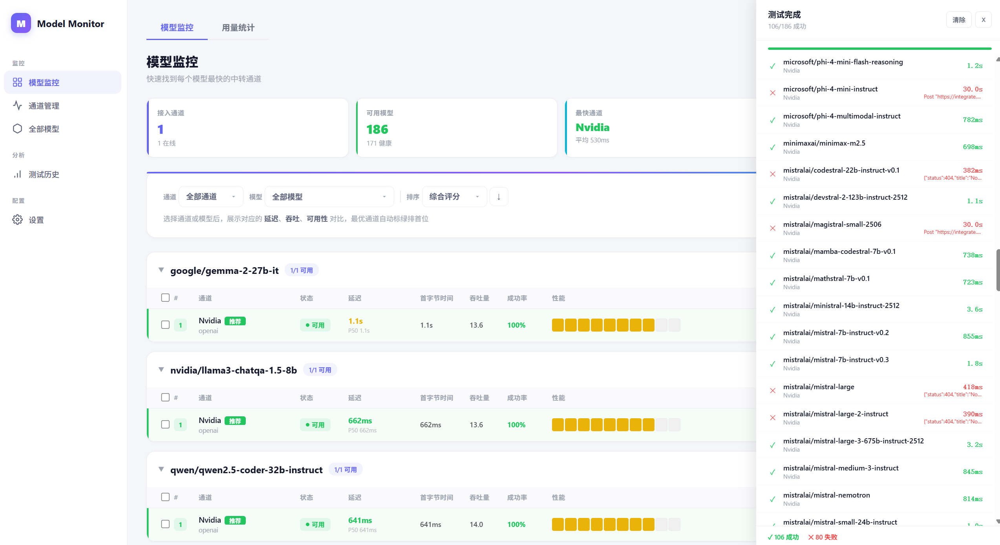
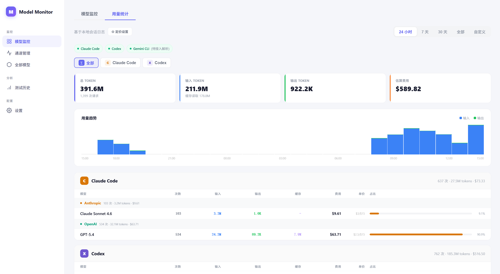
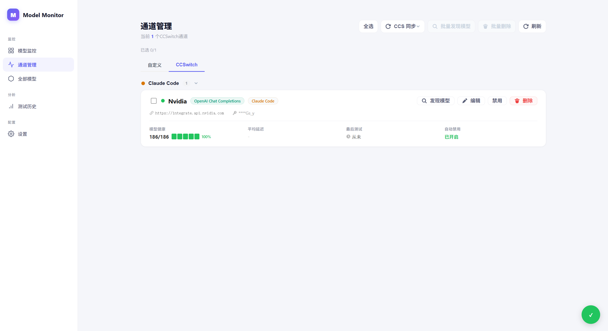
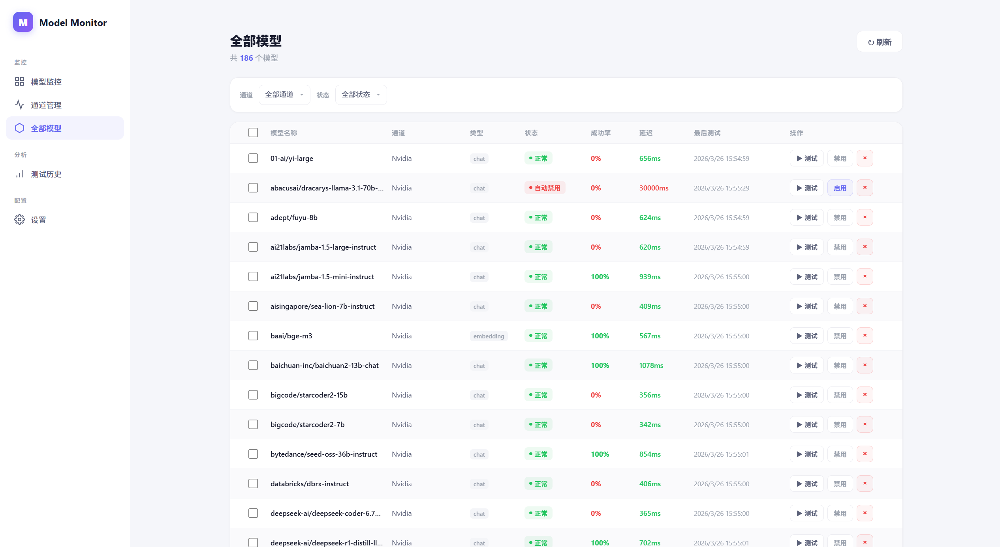
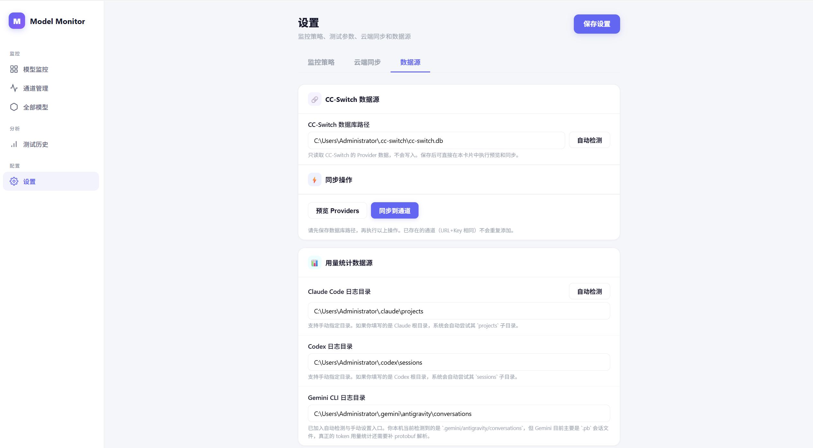
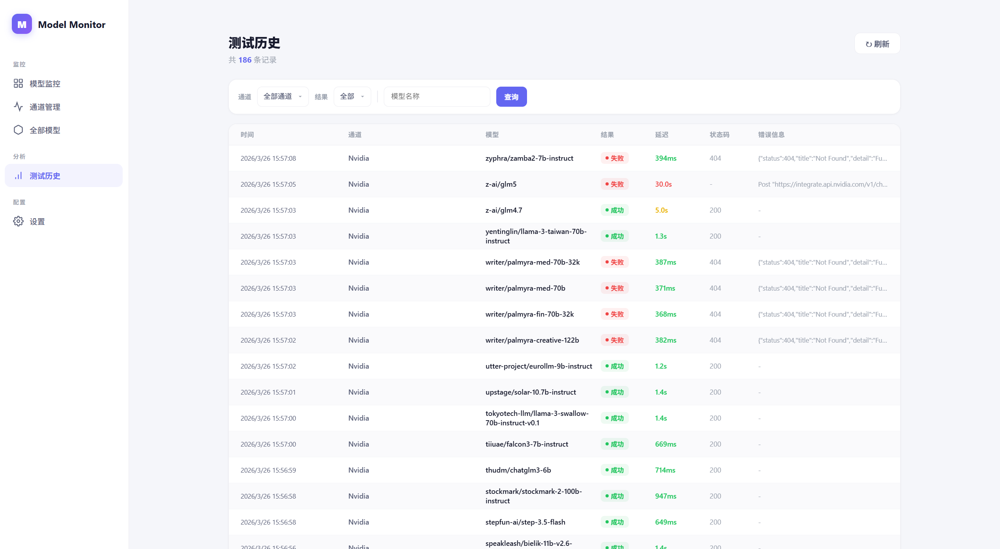

# Model Relay Watch

<p align="center">
  AI 模型中转服务监控平台，面向公益站与中转站的通道健康检查、历史追踪、统计分析与数据同步。
</p>

<p align="center">
  <strong>当前版本：</strong> v1.0.0<br />
  <strong>支持平台：</strong> Windows x64 / x86、macOS Intel / Apple Silicon、Linux amd64 / arm64 / arm32
</p>

---

## 项目简介

Model Relay Watch 是一个轻量、可自部署的 AI 模型中转监控工具，用于持续检测各通道的可用性、响应速度、调用结果与用量表现。项目内置 Web 管理界面，后端与前端打包为单个可执行程序，部署简单，适合个人和小团队长期使用。

## 功能概览

- **通道管理**：支持手动添加通道，也支持从 CCS 同步模型通道
- **多接口兼容**：支持 OpenAI、Anthropic、Responses API 等常见接口类型
- **自动巡检**：定时测试模型可用性、响应时间与错误状态
- **历史追踪**：保存每次测试记录，便于定位异常波动
- **统计分析**：按通道与模型查看成功率、平均响应时间、Token 用量
- **WebDAV 同步**：支持数据库快照同步，方便备份和多端共享
- **自动清理**：定期删除过期历史记录，降低本地数据体积
- **内置前端**：开箱即用，无需额外部署前端服务

## 技术栈

- **后端**：Go 1.21 + Gin + GORM + SQLite
- **前端**：React + TypeScript
- **存储**：SQLite 单文件数据库
- **部署方式**：前端构建产物内嵌至后端二进制

---

## 快速开始

### 1. 获取项目

```bash
git clone https://github.com/XF1080/model-relay-watch.git
cd model-relay-watch
```

### 2. 编译

**单平台编译：**

```bash
go build -o model-relay-watch .
```

**多平台构建：**

- Windows 环境：运行 `build.bat`
- 有 `make` 环境：运行 `make`

构建完成后会在 `dist/` 目录生成：

- `model-relay-watch-windows-amd64.exe`
- `model-relay-watch-windows-386.exe`
- `model-relay-watch-darwin-amd64`
- `model-relay-watch-darwin-arm64`
- `model-relay-watch-linux-amd64`
- `model-relay-watch-linux-arm64`
- `model-relay-watch-linux-arm`

### 3. 运行

Linux / macOS 示例：

```bash
./dist/model-relay-watch-linux-amd64
```

Windows 示例：

```powershell
.\dist\model-relay-watch-windows-amd64.exe
```

默认监听端口：

```text
http://localhost:8199
```

### 4. 启动参数

| 参数 | 默认值 | 说明 |
|------|--------|------|
| `-port` | `8199` | 监听端口 |
| `-db` | `data/model-relay-watch.db` | 数据库文件路径 |
| `-channel-name` | 空 | 初始通道名称 |
| `-channel-url` | 空 | 初始通道地址 |
| `-channel-key` | 空 | 初始通道 API Key |

示例：

```bash
./model-relay-watch -port 9000 -db /data/mrw.db
```

启动时直接初始化一个通道：

```bash
./model-relay-watch \
  -channel-name "我的中转站" \
  -channel-url "https://api.example.com" \
  -channel-key "sk-xxxx"
```

---

## 界面与功能说明

| 页面 | 说明 |
|------|------|
| 仪表盘 | 总览各通道健康状态、成功率与响应时间 |
| 通道管理 | 添加、编辑、删除、手动测试通道 |
| 历史记录 | 查看每次测试的详细结果 |
| Token 统计 | 按通道和模型统计 Token 用量 |
| 模型列表 | 查看各通道支持的模型 |
| 设置 | 配置自动测试间隔、WebDAV 同步、历史保留天数等 |

### 界面截图

> 以下截图来自项目实际运行界面。

#### 仪表盘 / 总览



#### 通道管理



#### 历史记录



#### Token 统计



#### 模型列表



#### 设置页面



---

## 通道类型

| 类型 | 接口格式 | 适用场景 |
|------|----------|----------|
| `openai` | OpenAI Chat Completions `/v1/chat/completions` | 大多数中转站 |
| `anthropic` | Anthropic Messages API `/v1/messages` | 原生 Claude 接口 |
| `responses` | OpenAI Responses API `/v1/responses` | 支持 Responses API 的服务 |

## WebDAV 同步

支持将本地数据库快照同步到 WebDAV 远程存储，适合多机共享数据或做远程备份。

在「设置」页面配置以下参数：

- **WebDAV 地址**：如 `https://dav.example.com`
- **用户名 / 密码**
- **远程目录**：默认 `cc-switch-sync`
- **配置名称**：默认 `default`，多端共用同一配置时保持一致

## 数据存储

所有数据默认存储在单个 SQLite 文件中：

```text
data/model-relay-watch.db
```

可通过 `-db` 参数自定义路径。

## 版本发布建议

当前发布版本：`v1.0.0`

建议 GitHub Releases 标题使用：

- `Model Relay Watch v1.0.0`

---

## License

[MIT](LICENSE)
